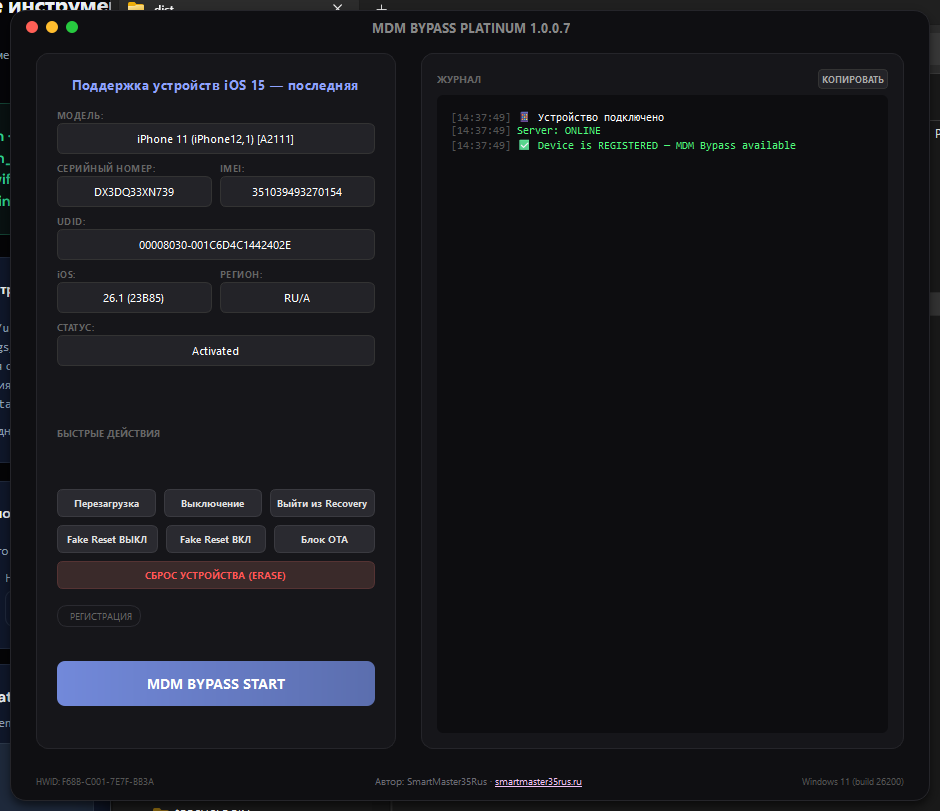

# MDM Profile Research Platinum

Windows-инструмент для исследованиеа MDM-профиля (Mobile Device Management) на iPhone и iPad.

> [!WARNING]
> Все действия выполняются на ваш страх и риск. Разработчик не несет ответственности за потерю данных, повреждение устройства или юридические последствия.

  

## Возможности

- **Исследование MDM-профиля** — удаление корпоративного управления и ограничений
- **Проверка регистрации** — ручная проверка статуса устройства на сервере в любой момент
- **Автоопределение устройства** — модель, серийный номер, IMEI, UDID, версия iOS, регион и статус
- **Быстрые действия** — перезагрузка, выключение, выход из Recovery, блокировка OTA-обновлений, сброс
- **Список поддерживаемых моделей** — актуальная таблица с сервера
- **Автообновление** — проверка и установка новых версий при запуске
- **Чейнджлог с GitHub** — список изменений загружается напрямую с GitHub Releases
- **Инженерное меню** (Ctrl+Shift+F11) — расширенные настройки для опытных пользователей
- **Поддержка языков** — английский, русский, испанский

## Системные требования

- **ОС:** Windows 10 (build 19041+) / Windows 11
- **Обязательно:** [3uTools](http://www.3u.com/) + iTunes из состава 3uTools (НЕ из Microsoft Store)
- USB-кабель для подключения устройства

## Поддерживаемые устройства

| Тип | Модели |
|-----|--------|
| **iPhone** | 6s / 6s Plus / SE (1st) / 7 / 7 Plus / 8 / 8 Plus / X / XR / XS / XS Max / 11 / 11 Pro / 11 Pro Max / SE (2nd) / 12 / 12 mini / 12 Pro / 12 Pro Max / 13 / 13 mini / 13 Pro / 13 Pro Max / SE (3rd) / 14 / 14 Plus / 14 Pro / 14 Pro Max / 15 / 15 Plus / 15 Pro / 15 Pro Max / 16 / 16 Plus / 16 Pro / 16 Pro Max / 16e / 17 / 17 Pro / 17 Pro Max / 17 Air |
| **iPad** | Air 2 / mini 4 / Pro 9.7 / Pro 12.9 (1st/2nd) / 5 / 6 / 7 / Pro 10.5 / Pro 11 (все поколения) / Pro 12.9 (3rd+) / Air 3 / Air 4 / Air 5 / Air 6 (M2) / Air 7 (M3) / mini 5 / mini 6 / mini 7 (A17 Pro) / M4 / M5 |
| **iPod** | 6 / 7 |

### Поддержка iOS

| Статус | Версии |
|--------|--------|
| Поддерживаются | iOS 15 — последняя |

> [!NOTE]
> Инструмент предназначен для работы с MDM-профилями на устройствах, которые вы имеете право обслуживать.

## Быстрый старт

1. Установите 3uTools + iTunes из комплекта 3uTools
2. Подключите устройство по USB (экран приветствия или MDM-блокировка должны быть активны, Wi-Fi подключён)
3. Запустите MDM Profile Research Platinum
4. Дождитесь определения устройства
5. Нажмите **MDM RESEARCH START**
6. Следуйте инструкциям на экране

## Контакты

- Поддержка: [t.me/SmartMaster35Rus](https://t.me/SmartMaster35Rus)
